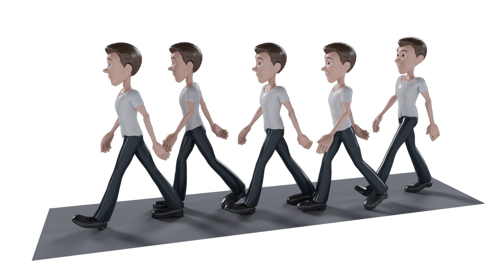
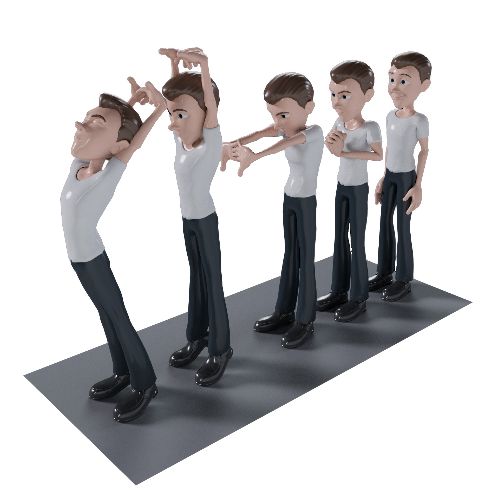

# MLLM-Motion 🎭

<div align="center">
  
</div>

## Overview

MLLM-Motion is an advanced multimodal large language model that specializes in generating and understanding human motion sequences. It can create realistic motion animations from text descriptions, process various forms of media including images, videos, and audio, and provide a user-friendly interface for motion generation and control.

## Features ✨

- **Motion Generation**: Create realistic human motion sequences from text descriptions
- **Multimodal Understanding**: Process and understand text, images, videos, and audio
- **Interactive Interface**: User-friendly Gradio-based web interface
- **Flexible Generation**: Generate various types of media based on user prompts
- **Advanced Architecture**: Built on state-of-the-art transformer models
- **Customizable Parameters**: Fine-tune generation parameters for optimal results

## Demo Showcase 🎬

<div align="center">
  <h3>Motion Generation Examples</h3>
  
  <table>
    <tr>
      <td align="center">
        
        <br>Dancing Motion
        <br><video width="300" controls>
          <source src="demo/dancing.mp4" type="video/mp4">
          Your browser does not support the video tag.
        </video>
      </td>
      <td align="center">
        
        <br>Walking Motion
        <br><video width="300" controls>
          <source src="demo/walking.mp4" type="video/mp4">
          Your browser does not support the video tag.
        </video>
      </td>
    </tr>
    <tr>
      <td align="center">
        
        <br>Stretching Motion
        <br><video width="300" controls>
          <source src="demo/stretching.mp4" type="video/mp4">
          Your browser does not support the video tag.
        </video>
      </td>
      <td align="center">
        
        <br>Picking Up Motion
        <br><video width="300" controls>
          <source src="demo/Pickingup_1.0096.mp4" type="video/mp4">
          Your browser does not support the video tag.
        </video>
      </td>
    </tr>
  </table>
</div>

## Installation 🛠️

1. Clone the repository:

```bash
git clone https://github.com/ltdoanh/MLLM-Motion.git
cd MLLM-Motion
```

2. Install dependencies:

```bash
pip install -r requirements.txt
```

3. Download the model checkpoints and place them in the appropriate directory.

## Usage 🚀

1. Start the demo application:

```bash
python code/demo_app.py
```

2. Open your web browser and navigate to the provided local URL.

3. Interact with the model through the web interface:
   - Upload images, videos, or audio files
   - Enter text prompts
   - Adjust generation parameters
   - View and download generated content

## Project Structure 📁

```
MLLM-Motion/
├── code/                      # Main code directory
│   ├── model/                # Model architecture and components
│   │   ├── MotionDiffuse/    # Motion diffusion models
│   │   ├── ImageBind/        # Multimodal encoder
│   │   ├── anyToImageVideoAudio.py  # Main model implementation
│   │   └── ...
│   ├── config/               # Configuration files
│   │   ├── training_config.py
│   │   └── inference_config.py
│   ├── dataset/              # Dataset handling
│   │   ├── motion_dataset.py
│   │   └── preprocessing/
│   ├── loss/                 # Loss functions
│   │   ├── motion_loss.py
│   │   └── multimodal_loss.py
│   ├── scripts/              # Utility scripts
│   │   ├── train.sh
│   │   └── evaluate.sh
│   └── demo_app.py           # Main demo application
├── demo/                     # Demo examples
│   ├── dancing.mp4          # Dancing motion demo
│   ├── walking.mp4          # Walking motion demo
│   ├── stretching.mp4       # Stretching motion demo
│   └── Pickingup_1.0096.mp4 # Picking up motion demo
├── checkpoints/             # Model checkpoints
│   ├── pretrain_ckpt/      # Pre-trained checkpoints
│   └── finetune_ckpt/      # Fine-tuned checkpoints
├── data/                    # Data directory
│   ├── raw/                # Raw motion data
│   ├── processed/          # Processed motion data
│   └── embeddings/         # Precomputed embeddings
├── docs/                    # Documentation
├── tests/                   # Test files
├── requirements.txt         # Python dependencies
└── README.md               # Project documentation
```

## Model Architecture 🧠

The model is based on the NextGPT architecture with the following key components:

- Transformer-based language model
- Multimodal encoders for different media types
- Custom diffusion models for generation
- Q-Former for cross-modal understanding

## Model Preparation 🧠

MLLM-Motion is built on top of the NExT-GPT architecture. To prepare the base models, follow these steps:

1. Download the required pre-trained checkpoints:

```bash
# ImageBind (unified image/video/audio encoder)
# Download imagebind_huge.pth from ImageBind repository
# Place at: .pretrain_ckpt/imagebind/

# Vicuna (language model)
# Download from Vicuna repository
# Place at: ./pretrain_ckpt/vicuna-7b-v1.5/

# Diffusion Models (will be automatically downloaded)
# - Stable Diffusion v2 (for image generation)
# - AudioLDM l-full (for audio generation)
# - ZeroScope v2_576w (for video generation)
```

2. Prepare the training data:

```bash
# Download and prepare the following datasets:
# - CC3M (text-image pairs)
# - WebVid (text-video pairs)
# - AudioCap (text-audio pairs)
# - LLaVA (visual instruction data)
# - Alpaca (textual instruction data)
# - VideoChat (video instruction data)
```

3. Precompute embeddings:

```bash
cd ./code/
python preprocess_embeddings.py ../data/T-X_pair_data/cc3m/cc3m_generation.json image ../data/embed/ stabilityai/stable-diffusion-2
```

4. Training steps:

```bash
# Step 1: Encoding-side LLM-centric Multimodal Alignment
bash scripts/pretrain_enc.sh

# Step 2: Decoding-side Instruction-following Alignment
bash scripts/pretrain_dec.sh

# Step 3: Instruction Tuning
bash scripts/finetune.sh
```

For more detailed information about the base model and training process, please refer to the [NExT-GPT repository](https://github.com/NExT-GPT/NExT-GPT).

## Contributing 🤝

Contributions are welcome! Please feel free to submit a Pull Request.

## License 📄

This project is licensed under the MIT License - see the LICENSE file for details.

## Acknowledgments 🙏

- [NExT-GPT](https://github.com/NExT-GPT/NExT-GPT) team for the base architecture and implementation
- [ImageBind](https://github.com/facebookresearch/ImageBind) for the unified multimodal encoder
- [Vicuna](https://github.com/lm-sys/FastChat) for the language model
- [Stable Diffusion](https://github.com/Stability-AI/stablediffusion) for image generation
- [AudioLDM](https://github.com/haoheliu/AudioLDM) for audio generation
- [ZeroScope](https://github.com/camenduru/zeroscope) for video generation
- Hugging Face for the transformers library
- All contributors and maintainers

---

<div align="center">
  
</div>
